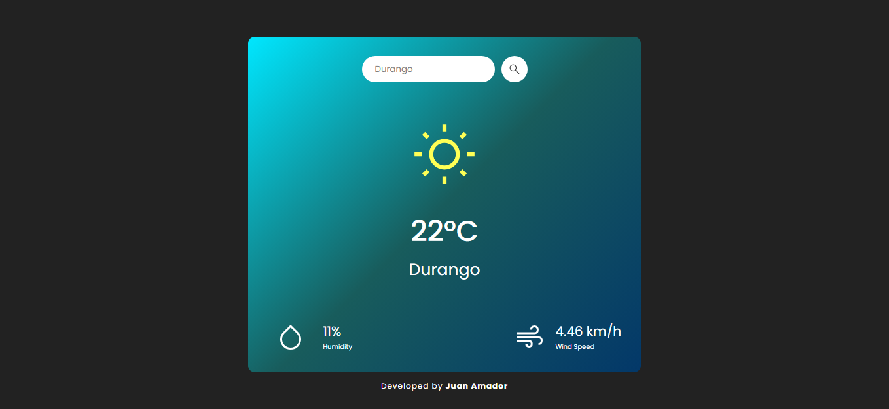
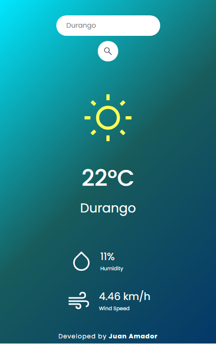
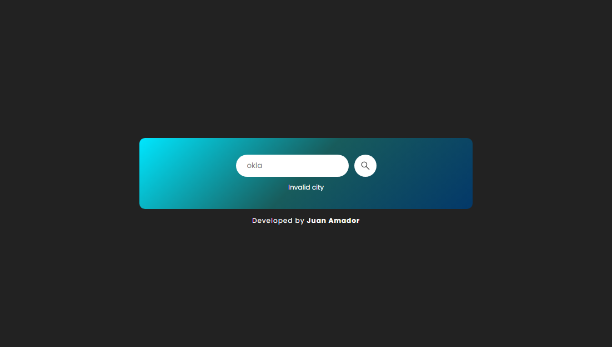

# 🌦️ Weather App

This is a basic weather information viewer that allows you to check the weather for any city using the OpenWeather API. To protect the API key, an intermediate server has been created to handle requests and hide the access key.

## 📌 Features

- Check the weather by entering the city name.
- Displays temperature, humidity, and weather conditions.
- Error handling and user-friendly messages.
- Implementation of an intermediate API in Render to protect the OpenWeather key.

## 🚀 Technologies Used

- **Frontend:** HTML, CSS, JavaScript (Fetch API)
- **Backend (independent of the frontend):** Node.js, Express
- **API:** OpenWeather (https://openweathermap.org/)
- **Backend Hosting:** Render (https://render.com/)

## 📸 Screenshots

##### 1. Weather Desktop Display



##### 2. Weather Mobile Display



##### 4. Message Active State



## Project Structure

```
/weather-app
│── design/ # Screenshots of the different app states
│── icons/  # Icons used in the interface
│── index.html
│── styles.css
│── script.js
│── README.md
```

## 🛠 Installation and Use

### 1. Clone the repository

```bash
git clone https://github.com/juanamador1009/weather-app
cd weather-app
```

### 2. Run the frontend

Open the `index.html` file in a browser or use a local server.

## 🧩 Using the Intermediate API

To protect the unique personal key (`apiKey`) that OpenWeather provides, I have implemented a separate backend hosted on Render, which exposes the following endpoint:

```
GET https://my-api-hub-tjkf.onrender.com/weather?city={city_name}
```

The response provides various data, but the following are the ones being used:

```json
{
  "name": "México",
  "main": {
    "temp": 33.84,
    "humidity": 30
  },
  "wind": {
    "speed": 1.77
  },
  "weather": [
    {
      "main": "Clouds"
    }
  ]
}
```

**Note:** You can check out [My API Hub](https://github.com/juanamador1009/my-api-hub/tree/main) repository for a clearer view of the weather request.

## 🧩 Backendless Alternative

If you prefer not to use an intermediate backend, you can make the request directly to OpenWeather using the following URL:

```
https://api.openweathermap.org/data/2.5/weather?units=metric&q={city}&appid={apiKey}
```

To obtain a personal key, log in to OpenWeather and create an account.

**Note:** This will expose your `apiKey` on the frontend.

## Error Handling

The frontend handles different server responses to inform the user:

- **400 / 404**: City not found or missing parameter.
- **500**: Server error.
---

## 👨‍💻 Author

Developed by: [Juan Amador](https://github.com/juanamador1009)
Repository: [GitHub](https://github.com/juanamador1009/weather-app)
